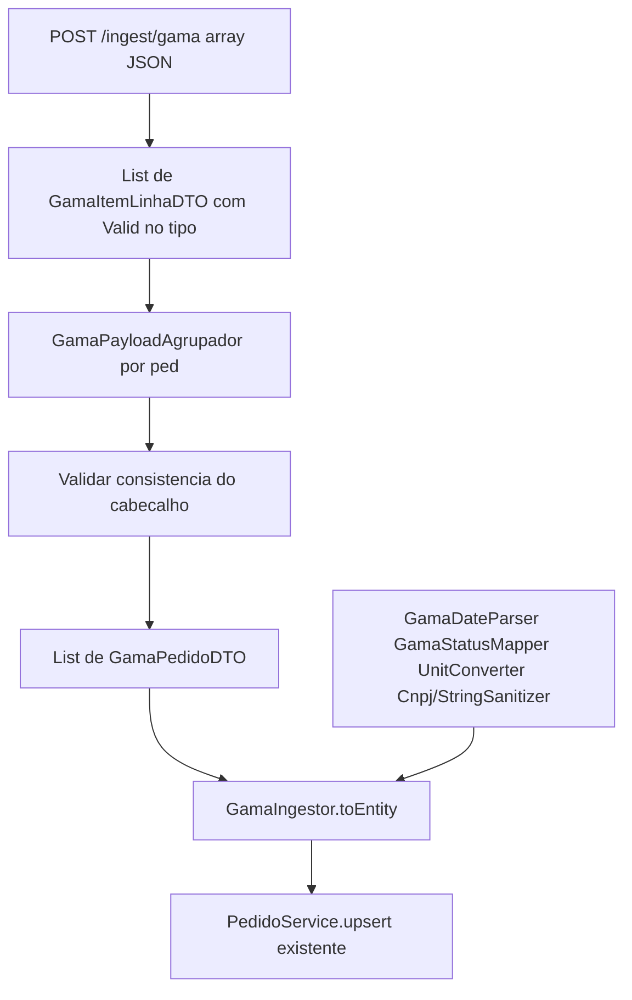

# Ingestão Gama (Parte 2) — plano corrigido

## Veredito

O plano em [`docs/development/parte-dois/gama/IMPLEMENTATION_CLAUDE.md`](docs/development/parte-dois/gama/IMPLEMENTATION_CLAUDE.md) **é válido para implementar**, com correções. As observações em [`OBS_CLAUDE.md`](docs/development/parte-dois/gama/OBS_CLAUDE.md) estão certas (teste dourado TRP-01, converter também `qtd_rec`, array raiz, `fator_conv > 0`, consistência por `ped`).

A contestação em [`CLAUDE_CONTEST_IMPLEMENTATION_PLAN.md`](docs/development/parte-dois/gama/CLAUDE_CONTEST_IMPLEMENTATION_PLAN.md) **entra no plano**: agrupamento fora do ingestor (`GamaPedidoDTO` + `GamaPayloadAgrupador`) e Bean Validation no argumento de tipo (`List<@Valid ...>`). Os dois pontos menores (assimetria do `StatusMapper` e `"UN"` fixo) **não mudam o código** — só a justificativa para entrevista.

**Não copiar o esqueleto Java original do Claude.** Ele inventou `PedidoDominio` / `ingerir(...)` e não leu o Strategy real.

## O que o Claude acertou (manter)

- Ordem bottom-up: DTO → normalizadores puros → (agrupador) → ingestor → controller → regressão Alfa/Beta.
- Body de `POST /ingest/gama` = array JSON, não wrapper (igual [`public/gamaLogisticaPayload.json`](public/gamaLogisticaPayload.json)).
- Agrupar por `ped` com `LinkedHashMap`.
- `quantidade_recebida = qtd_rec × fator_conv` (lacuna da tabela da seção 6 do design; o JSON da seção 2 já faz 2×12=24).
- `@Positive` em `fator_conv` (evita divisão por zero → 500).
- Validar cabeçalho repetido divergente entre linhas do mesmo `ped` → `IllegalArgumentException` (já vira 400 via [`ApiExceptionHandler`](src/main/java/com/v360/prosel/conectorpedidoscompra/controller/ApiExceptionHandler.java)).
- Não alterar Alfa, Beta, conferência, schema ou `PedidoService`.

## O que o Claude errou (corrigir)

- `PedidoDominio` / `ItemDominio` — o Strategy real é [`PedidoIngestor<T>#toEntity`](src/main/java/com/v360/prosel/conectorpedidoscompra/ingestor/strategy/PedidoIngestor.java) devolvendo `Pedido` JPA transiente. Espelhar [`AlfaIngestor`](src/main/java/com/v360/prosel/conectorpedidoscompra/ingestor/AlfaIngestor.java): `toEntity` + controller chama `pedidoService.upsert`.
- `StatusMapper<Integer>` — a interface é [`StatusMapper#map(String)`](src/main/java/com/v360/prosel/conectorpedidoscompra/normalizer/StatusMapper.java). **Não** alterar. `GamaStatusMapper` com `map(Integer)`, sem implementar a interface.
- `cnpjSanitizer.sanitizar` — usar [`CnpjSanitizer.sanitize`](src/main/java/com/v360/prosel/conectorpedidoscompra/normalizer/CnpjSanitizer.java) / [`StringSanitizer.sanitize`](src/main/java/com/v360/prosel/conectorpedidoscompra/normalizer/StringSanitizer.java). Parsers Gama estáticos (padrão `AlfaDateParser`).
- `linha.um()` como unidade da nota — no payload `um` é unidade de **compra** (`CX`). Persistir `"UN"`.
- Resposta `ok().build()` — replicar o `List<Map<String, Object>>` do Alfa/Beta (`id_pedido`, `numero_pedido_origem`, `cliente_origem`, `status`).
- Validar só CNPJ + `situacao` — validar os quatro campos repetidos por `ped` (cnpj, nome, `dt_criacao`, `situacao`).
- Agrupar **dentro** de `GamaIngestor.toEntities(List<GamaItemLinhaDTO>)` — ver seção seguinte.

## Ajuste estrutural (contestação): agrupador fora do ingestor

O [`DESING_V3.md`](docs/desing/DESING_V3.md) §1.2 separa Parser (Beta: join por `NUMERO_PEDIDO` → `List<BetaPedidoDTO>`) de Ingestor (`toEntity` recebe **um** pedido já aninhado). Colocar `toEntities` no `GamaIngestor` mistura as duas camadas e deixa `List<GamaItemLinhaDTO>` ambíguo (um pedido vs. o array inteiro). O compilador não impede chamar `toEntity` com a lista crua.

**Padrão a seguir (igual Beta):**

1. JSON array → `List<GamaItemLinhaDTO>` (entrada HTTP).
2. [`GamaPayloadAgrupador`](src/main/java/com/v360/prosel/conectorpedidoscompra/parser/GamaPayloadAgrupador.java) (estático, testável sem Spring): agrupa por `ped` + valida consistência → `List<GamaPedidoDTO>`.
3. [`GamaIngestor`](src/main/java/com/v360/prosel/conectorpedidoscompra/ingestor/GamaIngestor.java) `implements PedidoIngestor<GamaPedidoDTO>` — só mapeia DTO pronto → `Pedido`. Sem método extra `toEntities`.

`GamaPedidoDTO` é **interno** (não é o body HTTP), no mesmo papel de [`BetaPedidoDTO`](src/main/java/com/v360/prosel/conectorpedidoscompra/dto/beta/BetaPedidoDTO.java):

```java
public record GamaPedidoDTO(
    String ped,
    String cnpjFornecedor,
    String nomeFornecedor,
    Long dtCriacao,
    Integer situacao,
    List<GamaItemLinhaDTO> itens
) {}
```

Cabeçalho do record = primeira linha do grupo, depois de validar que as demais concordam em cnpj, nome, `dt_criacao` e `situacao`. Lista nula/vazia no agrupador → `IllegalArgumentException`.

## Decisões fechadas (não reabrir)

- **Moeda:** `"BRL"` constante. O payload Gama não tem campo; o contrato da seção 2 já assume BRL.
- **Unidade persistida:** sempre `"UN"` após conversão por `fator_conv` (bate com o exemplo da seção 2 e com os três itens do payload oficial). `um` do JSON é só contexto de compra e **não** vai para o banco. Não inventar tabela `CX→UN`; o hardcode é o que o desafio narra para o Gama, não uma regra geral de unidade para outros clientes.
- **Cliente origem:** `"GAMA"`.
- **Data:** `Instant.ofEpochSecond(dt_criacao)` — `1786752000` → `2026-08-15T00:00:00Z` (teste dourado).
- **Status:** `1→OPEN`, `2→CLOSED`, `3→BLOCKED`; outro valor → `IllegalArgumentException`. `GamaStatusMapper` **não** implementa `StatusMapper`: mudar a interface para genérica tocaria Alfa/Beta (quebra Open/Closed). Assimetria consciente — resposta de entrevista: o contrato compartilhado é `map(String)`; Gama chega `Integer`.
- **Preço:** `(centavos / 100) / fator_conv`, `RoundingMode.HALF_UP`, escala 4 (`NUMERIC(15,4)`). Escala intermediária 10 no primeiro `divide`.

## Fluxo



## Implementação (só adicionar)

Não mexer em classes Alfa/Beta. Pacote: `com.v360.prosel.conectorpedidoscompra`.

### 1. DTOs

**`dto/gama/GamaItemLinhaDTO.java`** — espelho do JSON. Record com `@JsonProperty` em cada campo snake_case (não há `@JsonNaming` global). Constraints:

- `ped`, `cnpj_fornecedor`, `nome_fornecedor`, `cod_mat`, `desc_mat`: `@NotBlank`
- `item`, `dt_criacao`, `situacao`: `@NotNull`
- `fator_conv`: `@NotNull @Positive` (Integer)
- `qtd_ped`: `@NotNull @Positive` (`BigDecimal`)
- `qtd_rec`: `@NotNull @PositiveOrZero` (`BigDecimal`) — o payload tem `0`
- `preco_unit_centavos`: `@NotNull @PositiveOrZero` (`Long`)

Não anotar `situacao` com `@Min/@Max`: status inválido cai no mapper (mensagem clara), como Alfa/Beta.

Teste: `ObjectMapper` lê `public/gamaLogisticaPayload.json` → 3 linhas; conferir os 13 campos da primeira.

**`dto/gama/GamaPedidoDTO.java`** — pós-agrupamento; sem anotações Jackson.

### 2. `GamaPayloadAgrupador` (`parser/`)

Utilitário estático. `List<GamaItemLinhaDTO>` (N pedidos) → `List<GamaPedidoDTO>` (`LinkedHashMap` por `ped`). Validação de consistência **aqui**, não no ingestor.

Testes: payload oficial → 2 pedidos (GL-778 com 2 itens, GL-779 com 1); cabeçalho divergente → IAE; lista vazia/nula → IAE.

### 3. Normalizadores puros

- **`GamaDateParser`**: estático, `parse(Long)` → `Instant.ofEpochSecond`; null-safe.
- **`GamaStatusMapper`**: `@Component`, `map(Integer)` com switch 1/2/3; null/desconhecido → IAE. Não implementa `StatusMapper`.
- **`UnitConverter`**: estático (como `CnpjSanitizer`).
    - `converterQuantidade(qtd, fator)` = `qtd × fator`
    - `converterPrecoUnitario(centavos, fator)` = `(centavos/100) / fator`

Testes dourados: `10,12` → `120`; `2,12` → `24`; `120000,12` → `100.0000`; `10000,3` → `33.3333`.

### 4. `GamaIngestor`

`implements PedidoIngestor<GamaPedidoDTO>`. Único método público de transformação: `toEntity(GamaPedidoDTO)`.

Montar `Fornecedor` + `Pedido` + `Item` como o Alfa (ArrayList mutável; **não** setar `quantidadePendente`).

- `linha` do item = `String.valueOf(item)` do payload
- quantidades via `UnitConverter` (pedida **e** recebida)
- `unidadeMedida = "UN"`
- `descricao` / nome via `StringSanitizer.sanitize`
- `clienteOrigem = "GAMA"`, `moeda = "BRL"`
- `dataIngestao` fica para o `PedidoService`

Injetar só `GamaStatusMapper` (parsers estáticos).

Teste puro (`new`, sem Spring): agrupar o payload oficial e mapear — TRP-01 = 120 / 24 / 100.00 / `UN` / `OPEN`; TRP-09 preço `33.3333`; GL-779 `CLOSED` e qtd 100/100.

### 5. Controller — `GamaController`

Espelhar [`AlfaController`](src/main/java/com/v360/prosel/conectorpedidoscompra/controller/AlfaController.java). Bean Validation no **argumento de tipo** (container element constraint), não só no parâmetro — evita wrapper que quebraria o JSON oficial:

```java
@PostMapping("/gama")
@ResponseStatus(HttpStatus.OK)
public List<Map<String, Object>> ingestirGama(
        @RequestBody List<@Valid GamaItemLinhaDTO> linhas)
```

Fluxo: `GamaPayloadAgrupador.agrupar(linhas)` → para cada `GamaPedidoDTO`, `gamaIngestor.toEntity` + `pedidoService.upsert` → mesmo mapa de resposta do Alfa/Beta.

Lista vazia: 400 via IAE do agrupador. `fator_conv: 0` numa linha: 400 Bean Validation.

### 6. Testes e regressão

Novos: desserialização do DTO, `GamaPayloadAgrupadorTest`, `GamaDateParserTest`, `GamaStatusMapperTest`, `UnitConverterTest`, `GamaIngestorTest`.

Rodar a suíte inteira. Nenhum teste Alfa/Beta pode quebrar.

No teste do ingestor, GL-779 com pedida=recebida prova pendência zero no domínio (filtro `com_pendencia` já existe; não reabrir consulta).

### 7. README (mínimo da Parte 2)

Nota: Gama foi **só adicionar** (DTO linha + DTO pedido + agrupador + ingestor + controller + `UnitConverter`). Decisões: BRL fixo, persistir `UN`, converter `qtd_rec`, agrupador separado do ingestor. Não fazer o DIA6 completo (H2, Postman, `AI_USAGE` cheio) neste passo.

**Fora de escopo:** `git tag`, conferência, schema, alterar `StatusMapper`.

## Teste dourado (números oficiais)

Item `TRP-01` / `GL-778`: `qtd_ped 10 × 12 = 120`, `qtd_rec 2 × 12 = 24`, pendente 96 (coluna gerada no banco), `120000/100/12 = 100.00`, unidade `UN`, status `OPEN`.
