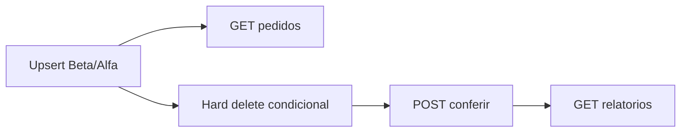

# Plano: alinhar consulta (DIA3) e depois fechar conferência (DIA4)

## O que deu errado (diagnóstico)

A IA anterior tentou avançar DIA3 e DIA4 juntos e **preencheu lacunas com decisões próprias**. O [CLAUDE_HELP.md](docs/development/parte-um/divergencia-conferencia/CLAUDE_HELP.md) fechava só a consulta. O [IMPLEMENTATION-PLAN.md](docs/development/parte-um/divergencia-conferencia/IMPLEMENTATION-PLAN.md) misturou consulta, entidades, órfãos e conferência. O [3 ETAPA DESING.md](docs/desing/3%20ETAPA%20DESING.md) já tinha as quatro regras de negócio fechadas — elas não precisavam ser reinventadas.



Onde o código atual **falha em relação ao combinado**:

### 1. Consulta — filtro `fornecedor` (decisão precipitada)

Decisão fechada: parâmetro `fornecedor` = **CNPJ sanitizado** (`CnpjSanitizer`, igualdade). Busca por nome **fora do escopo**.

O que existe em [PedidoController.java](src/main/java/com/v360/prosel/conectorpedidoscompra/controller/PedidoController.java) e [PedidoRepository.java](src/main/java/com/v360/prosel/conectorpedidoscompra/repository/PedidoRepository.java):

- Três aliases (`fornecedor`, `cnpj`, `fornecedor_cnpj`) sem combinado.
- JPQL faz `cnpj = :fornecedor OR nome LIKE %valor%`.
- Sem `CnpjSanitizer` — máscara no query param não bate com o CNPJ persistido.

### 2. Consulta — `com_pendencia=false` está quebrado

Decisão fechada: omitido = sem filtro; `true` = existe item com pendente &gt; 0; `false` = **todos** os itens com pendente = 0.

JPQL atual:

```sql
(:comPendencia is null or :comPendencia = false
 or exists (... pendente > 0))
```

Quando `false`, a cláusula é **sempre verdadeira**. Pedidos com saldo pendente continuam na lista. O CLAUDE_HELP pedia **duas queries** (com/sem `EXISTS`) e o service escolhia; a IA fez uma query só e errou o `false`.

### 3. Contrato da lista vs detalhe

Decisão fechada:

- Lista: resumo **sem itens**.
- Detalhe: resumo + itens, `quantidade_pendente` vinda do banco.

O que existe:

- [PedidoResponseDTO](src/main/java/com/v360/prosel/conectorpedidoscompra/dto/pedido/PedidoResponseDTO.java) único, **sempre com itens**, mais um campo extra `comPendencia` que o contrato de domínio (§2 do design) não tem.
- Lista faz `JOIN FETCH` de itens — exatamente o que a lista não deveria carregar.
- Detalhe usa `findById` **sem** `JOIN FETCH` / `@EntityGraph` — risco de `LazyInitializationException` em `itens` e `fornecedor` (ambos `LAZY`).
- [PedidoConsultaService](src/main/java/com/v360/prosel/conectorpedidoscompra/service/PedidoConsultaService.java) **recalcula** pendente em Java se a coluna gerada vier nula. O combinado era: leitura fresca do Postgres, sem recálculo.

### 4. JSON da API de consulta vs contrato único

Alfa já devolve snake_case (`id_pedido`, `numero_pedido_origem`). Os records de consulta **não** têm `@JsonProperty`. A resposta sai camelCase (`id`, `numeroPedidoOrigem`), diferente do contrato da seção 2 do design (`id_pedido`, `numero_pedido`, `id_fornecedor`, etc.).

### 5. HTTP / erros

`404` no detalhe existe, mas via `ResponseStatusException` sem corpo padronizado. `GET /pedidos` vazio como `200` está ok. Status inválido como `400` é razoável e pode ficar.

Não há testes de filtro real (JPQL): [PedidoConsultaServiceTest](src/test/java/com/v360/prosel/conectorpedidoscompra/service/PedidoConsultaServiceTest.java) só mocka o repositório e ainda **espera itens na lista**.

### 6. Órfãos no upsert (preparação da conferência, mas já no código)

Regra fechada (§3.5.1): apagar linha que sumiu do arquivo **somente se** `quantidade_recebida = 0` **e** o item **não** aparece em `Divergencia` daquele pedido. Qualquer recebimento ou divergência daquele material/linha **preserva**.

[PedidoService.removerOrfaos](src/main/java/com/v360/prosel/conectorpedidoscompra/service/PedidoService.java) adicionou `existsByPedido_Id`: **qualquer** conferência do pedido (mesmo só `FORNECEDOR_DIVERGENTE`) **congela todos os órfãos**. Isso deixa pendência fantasma — o problema que o hard delete deveria evitar.

`orphanRemoval = true` em `Pedido.itens` continua no mapeamento. O upsert atual não dá `clear()` no existente, mas a cascata continua sendo armadilha; o design pediu delete **explícito e condicional**.

### 7. DIA4: casca sem o núcleo

Existe e é reutilizável com ajuste fino:

- Entidades [Conferencia](src/main/java/com/v360/prosel/conectorpedidoscompra/entity/Conferencia.java) / [Divergencia](src/main/java/com/v360/prosel/conectorpedidoscompra/entity/Divergencia.java)
- Enums alinhados ao DDL
- DTOs de nota com `cliente_origem` obrigatório (decisão boa do plano antigo)
- Repositórios com counts

**Não existe:** `ConferenciaService`, `POST /notas-fiscais/conferir`, `GET /relatorios/conferencias`. Sem isso o DIA4 não está feito.

Pontos da casca a não copiar cegamente depois:

- [DivergenciaDTO](src/main/java/com/v360/prosel/conectorpedidoscompra/dto/conferencia/DivergenciaDTO.java) usa `BigDecimal` enquanto a coluna é `TEXT`.
- `@Positive` na quantidade/valor da nota rejeita `0` (validação de payload, não regra de conferência).
- `JsonAlias` extras (`cnpj`, `valor`) — contrato único, sem aliases inventados.

### 8. O que **não** deve ser reaberto

Já fechado no design; só implementar:

- Tolerância absoluta R$ 0,05 (`BigDecimal`, nunca `double`).
- `BLOCKED`/`CLOSED` registram e **continuam**.
- Casamento por soma de `quantidade_pendente` por `codigo_material`; preço ponderado pelo pendente.
- Pedido inexistente: persistir `REJEITADA` + `PEDIDO_NAO_ENCONTRADO`, HTTP **200**.
- Sem paginação.
- Sem mudar DDL salvo bug concreto.

---

## Etapa A — corrigir DIA3 (prioridade)

Arquivos centrais: [PedidoController](src/main/java/com/v360/prosel/conectorpedidoscompra/controller/PedidoController.java), [PedidoConsultaService](src/main/java/com/v360/prosel/conectorpedidoscompra/service/PedidoConsultaService.java), [PedidoRepository](src/main/java/com/v360/prosel/conectorpedidoscompra/repository/PedidoRepository.java), DTOs em `dto/pedido/`.

1. **Filtros**
   - Um único query param: `fornecedor` (CNPJ). Remover aliases.
   - Sanitizar com `CnpjSanitizer` no service.
   - JPQL: igualdade em `f.cnpj`; sem `LIKE` em nome.
   - Duas queries (ou equivalente explícito):
     - sem cláusula de pendência;
     - com `EXISTS` (true) **ou** `NOT EXISTS` de item com pendente &gt; 0 (false).
   - Lista: `JOIN FETCH` só de `fornecedor`, **não** de itens.
   - Detalhe: `JOIN FETCH` de `fornecedor` e `itens` por id.

2. **DTOs**
   - Lista: record de resumo sem itens e sem `comPendencia`.
   - Detalhe: resumo + `itens`.
   - `@JsonProperty` no contrato da seção 2 (`id_pedido`, `numero_pedido`, `cliente_origem`, `id_fornecedor`, …).

3. **Service**
   - Não recalcular `quantidade_pendente`.
   - 404: lançar no service ou manter no controller, mas com corpo de erro no estilo REST do projeto (hoje só Alfa devolve `Map` snake_case; padronizar o 404 de forma simples, sem inventar framework).

4. **Testes (mínimo do CLAUDE_HELP)**
   - Cada filtro isolado + combinação de dois.
   - `com_pendencia=true/false` com pedido totalmente recebido vs parcial.
   - Detalhe com vários itens: pendente = pedida − recebida **lida**, não inventada.
   - Id inexistente → 404.
   - Preferir testes de repositório/controller contra Postgres se o ambiente já usa Compose; Mockito só para mapeamento, não para “provar” o JPQL.

5. **Órfãos (cirúrgico, ainda na Etapa A)**
   - Remover `existsByPedido_Id` como veto global.
   - Preservar só se `quantidade_recebida > 0` **ou** existe `Divergencia` daquele pedido + `codigo_material`.
   - Ajustar [PedidoServiceTest](src/test/java/com/v360/prosel/conectorpedidoscompra/service/PedidoServiceTest.java): caso “conferência no pedido sem divergência daquele material” **deve apagar** o órfão sem recebimento.

Não implementar paginação. Não refatorar Beta/Alfa.

---

## Etapa B — DIA4 (depois da consulta estável)

1. **`ConferenciaService` transacional**
   - Localizar por `(numero_pedido, cliente_origem)`.
   - Acumular lista; persistir no fim: `APROVADA` se vazia, senão `REJEITADA` + uma `Divergencia` por falha.
   - Ordem: pedido inexistente (para o cruzamento de linhas) → fornecedor → status (não aborta) → materiais agregados → quantidade vs soma de pendente → valor com tolerância 0,05 e preço ponderado.
   - CNPJ da nota via `CnpjSanitizer`.

2. **Endpoints**
   - `POST /notas-fiscais/conferir` → 200 sempre que o payload for válido (incluindo pedido inexistente).
   - `GET /relatorios/conferencias` → totais por resultado e por tipo a partir do histórico persistido (`countByResultado` / `countByTipo` já existem).
   - 400 só para payload inválido (`@Valid`).

3. **Ajuste fino dos DTOs já criados**
   - Alinhar tipos `valor_esperado` / `valor_recebido` ao TEXT da entidade (string).
   - Contrato snake_case; tirar aliases soltos se não estiverem no enunciado.
   - Validação: `@NotNull` + não-negativo se fizer sentido; não usar `@Positive` se 0 for payload válido.

4. **Testes**
   - Um teste por tipo da tabela 5.2 + combinação no mesmo pedido.
   - Tolerância no limite 0,05 (não divergente) e acima (divergente).
   - Duas linhas do mesmo material (agregação + ponderação).
   - `BLOCKED`/`CLOSED` com outras falhas na mesma resposta.
   - Pedido inexistente → 200 + persistência.
   - Relatório reflete o que foi persistido.

5. **Fechamento documental (quando a Etapa B passar)**
   - README: quatro decisões, `cliente_origem` na nota, contrato dos endpoints, 200 de negócio vs 404 técnico, o que o Beta persiste vs o que a conferência persiste.
   - Relatório Markdown curto da implementação (chave composta + órfãos).
   - `git tag parte-1` **só depois** disso — fora desta correção até você pedir.

---

## Fora de escopo

- Gama, paginação, vídeo, redesenho do schema, reabrir ingestão Alfa/Beta.
- Recalcular as decisões 1–4 do design.
